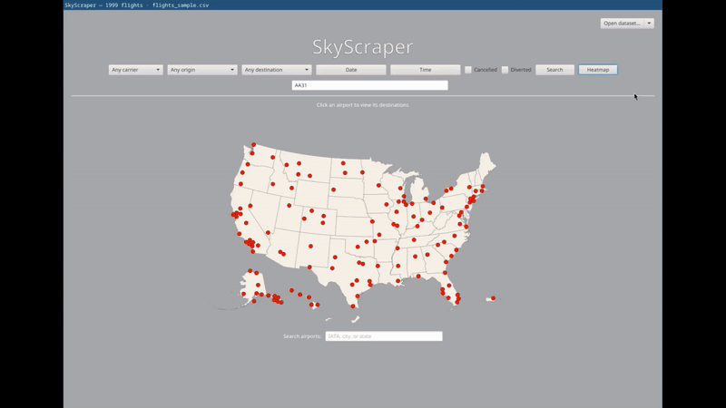
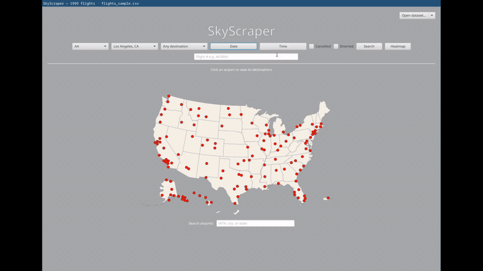

  

# SkyScraper

A desktop app for exploring U.S. commercial flight datasets — load a CSV from the Bureau of Transportation Statistics, see where the flights go on a map, and slice them by carrier, route, date, time, and status.

## Features
- **Albers-USA map** with state outlines and airport dots. Heatmap colours states by volume of flights.
- **Search** — carrier/origin/destination cascade together; date range; time; cancelled/diverted toggles.
- **Per-flight details** showing scheduled vs actual times with signed-minute delay deltas, badges for cancelled/diverted.
- **Drill-ins**: click a dot → destination graph for that airport; click a bar → table of flights for that origin→destination pair.
- **Drag-and-drop** any flights CSV onto the window; recents menu remembers the last 5.
- **Keyboard-friendly navigation** — Esc returns to the previous scene.

## Downloads
Portable bundles per platform on the [Releases page](https://github.com/CoffeeMan1ac/SkyScraper/releases) — Linux AppImage, macOS `.app`, Windows folder.

Or build from source (Java 24 + JavaFX 24): `./mvnw javafx:run`. A bundled `flights_sample.csv` (~2,000 rows, January 2022) loads launch.

## Data

The app reads **BTS Marketing Carrier On-Time Performance** CSVs
(US Department of Transportation; one row per US commercial flight,
monthly, since January 2018).

A 2,000-flight sample (`flights_sample.csv`) ships with the repo.

### Loading more data from BTS

1. Open <https://www.transtats.bts.gov> → Data Finder → Aviation →
   Airline On-Time Performance Data → **Marketing Carrier On-Time
   Performance (Beginning January 2018)**.
2. Tick exactly these 18 fields

   | Section | Field |
   |---|---|
   | Time Period | `FlightDate` |
   | Airline | `IATA_Code_Marketing_Airline` |
   | Airline | `Flight_Number_Marketing_Airline` |
   | Origin | `Origin` |
   | Origin | `OriginCityName` |
   | Origin | `OriginState` |
   | Origin | `OriginWac` |
   | Destination | `Dest` |
   | Destination | `DestCityName` |
   | Destination | `DestState` |
   | Destination | `DestWac` |
   | Departure Performance | `CRSDepTime` |
   | Departure Performance | `DepTime` |
   | Arrival Performance | `CRSArrTime` |
   | Arrival Performance | `ArrTime` |
   | Cancellations and Diversions | `Cancelled` |
   | Cancellations and Diversions | `Diverted` |
   | Flight Summaries | `Distance` |

3. Pick a year/month under the geography/year/period filters,
   click **Download**.
4. Open the resulting CSV in the app via **Open dataset** or drag
   and drop it into the window

## Tech stack
- Java 24, JavaFX 24
- ControlsFX
- OpenCSV
- Maven build · `jpackage` app-image distribution
- TopoJSON state outlines from [us-atlas](https://github.com/topojson/us-atlas)
- Airport coordinates from [OurAirports](https://ourairports.com/)

## License

